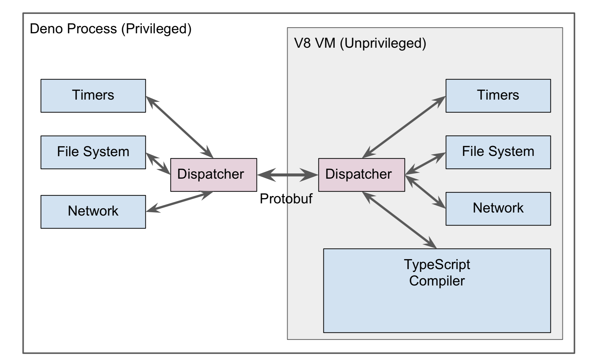

基本的依赖可以参考github

> 我的环境是centos 7

## 基本安装

> 需要golang  以及yarn安装

* Protobuf 3

> 这是官方的方式，实际可以变通下

```code
cd ~
wget https://github.com/google/protobuf/releases/download/v3.1.0/protoc-3.1.0-linux-x86_64.zip
unzip protoc-3.1.0-linux-x86_64.zip
export PATH=$HOME/bin:$PATH
```

* protoc-gen-go  && go-bindata

> protobuf 代码生成** 资源访问

```code
go get -u github.com/golang/protobuf/protoc-gen-go

go get -u github.com/jteeuwen/go-bindata/...
```

* v8worker2(漫长。。大概30分钟。。。，反正就是很慢)

```code
go get -u github.com/ry/v8worker2

cd $GOPATH/src/github.com/ry/v8worker2

./build.py --use_ccache
```

* deno 安装

```code
go get -u github.com/ry/deno/...

cd $GOPATH/src/github.com/ry/deno

make # Wait for redacted
```

## demo 运行

> 默认go get 已经有demo 了

* 基本demo

```code
./deno testdata/001_hello.js # 输出 : Hello World

```

## 测试安装结果

```code
ldd deno
 输出:
 linux-vdso.so.1 => (0x00007fff8146f000)
 libpthread.so.0 => /lib64/libpthread.so.0 (0x00007fed1355c000)
 libstdc++.so.6 => /lib64/libstdc++.so.6 (0x00007fed13255000)
 libm.so.6 => /lib64/libm.so.6 (0x00007fed12f53000)
 libgcc_s.so.1 => /lib64/libgcc_s.so.1 (0x00007fed12d3d000)
 libc.so.6 => /lib64/libc.so.6 (0x00007fed12970000)
 /lib64/ld-linux-x86-64.so.2 (0x00007fed13778000)

```

## 几个问题

> 构建安装之前最好 yum update -y  更新下系统，同时最好安装 ccache

* v8worker2 问题

```code
tar (child): lbzip2: Cannot exec: No such file or directory  yum install lbzip2
Package glib-2.0 was not found in the pkg-config search path.  yum install glib2 
error: 'queue' file not found    yum install  clang
error: unable to find library -lstdc++  安装  yum install -y libstdc++-static
error: cannot open /usr/lib64/libatomic.so.1.0.0: No such file or directory 安装yum install  libatomic-static
```

* golang 包墙的问题

```code
不好解决，最好合理上网解决，或者自己clone 代码
```

* deno make 问题

```code
提示invalid flag in pkg-config --cflags:   可能是golang 版本问题 1.9.4 建议使用新版本（我使用go1.10.2）
```

* g++的问题

```code
提示 exec: "g++": executable file not found in $PATH
yum install gcc-c++ -y  
```

## 一张参考架构图



## nodejs 的比较

> 参考作者的pdf 文档http://tinyclouds.org/jsconf2018.pdf

> && youtube  https://www.youtube.com/watch?v=M3BM9TB-8yA

## 参考资料

https://github.com/ry/deno